# Etap 3 — Low-Fi Wireframes + User Flow

> Mapowanie do briefu: to jest **Etap 2 wg briefu** („Wireframes i struktura aplikacji", 10% oceny).
> Numeracja plików w repo jest przesunięta o jeden (Etap1 = analiza, Etap2 = journey maps bonus, Etap3 = wireframes).

**Status:** ukończony · **Wersja:** v2 · 2026-05-25
**Źródło prawdy:** Figma — [WSB PIU · Task Manager · Wireframes v2](https://www.figma.com/design/K0KmpAI1zpBD8Z8KvVEK43/WSB-PIU-%E2%80%94-Task-Manager-%C2%B7-Wireframes-v2)

Wszystkie widoki to **natywne, edytowalne frame'y** w Figmie (nie spłaszczony import PDF). PNG-i w [`docs/wireframes/`](./docs/wireframes/) to eksporty robocze do dokumentacji — przy każdej zmianie w Figmie re-eksportuj i nadpisz. Plik Figma pozostaje jedynym źródłem prawdy.

Niskim poziomem szczegółowości (low-fi: krem/atrament, czcionka „handwritten") celowo trzymamy dyskusję na **strukturze i przepływie**, nie na kolorach — te przychodzą w Etapie 3 (Hi-Fi).

---

## 1. Inwentarz ekranów

10 widoków mobile (360 × 720) + 9 widoków desktop (1328 × 848). Każdy widok odpowiada konkretnej potrzebie z [analizy person](./Etap1_Analiza_UX.md) i [map podróży](./Etap2_Journey_Maps.md).

| Widok | Mobile | Desktop | Główna potrzeba (persona) |
|---|---|---|---|
| Splash / logika startu | ✅ | — (inline w onboardingu) | Pierwsze uruchomienie — rozgałęzienie nowy vs powracający |
| Onboarding (imię) | ✅ | ✅ | Lekki próg wejścia, bez konta (wszystkie persony) |
| Dziś (kokpit) | ✅ | ✅ | Anna — „tylko dzisiejsze"; szybki przegląd po otwarciu |
| Empty state | ✅ | ✅ | Pierwszy kontakt — co robić, gdy lista pusta (Anna) |
| Wszystkie zadania | ✅ | ✅ (tabela) | Marek — dużo zadań z różnych kontekstów |
| Nowe zadanie | ✅ (06a) | ✅ (panel) | CRUD: termin + priorytet + kategoria (Kasia, Marek) |
| Edycja zadania | ✅ (06b) | ✅ (panel) | Zmiana terminu/szczegółów (Anna) |
| Szukaj | ✅ | — (inline w tabeli) | Marek — wyszukiwarka po wielu kontekstach |
| Filtry | ✅ (bottom sheet) | ✅ (popover) | Marek/Anna — filtrowanie i sortowanie |
| Kategorie | — (w filtrach) | ✅ | Marek — prywatne vs side-project; Kasia — przedmioty |
| Ustawienia / „Ja" | ✅ (Ja) | ✅ (Ustawienia) | Dark mode (Kasia, Marek); zmiana imienia |
| Usuwanie | inline (undo) | ✅ (modal) | Zapobieganie błędom (Anna) |

---

## 2. Widoki mobile

Wzorzec: nawigacja push (pełne ekrany), dolny pasek nawigacji, filtry jako bottom sheet, usuwanie inline z opcją cofnięcia.

| | | |
|---|---|---|
| 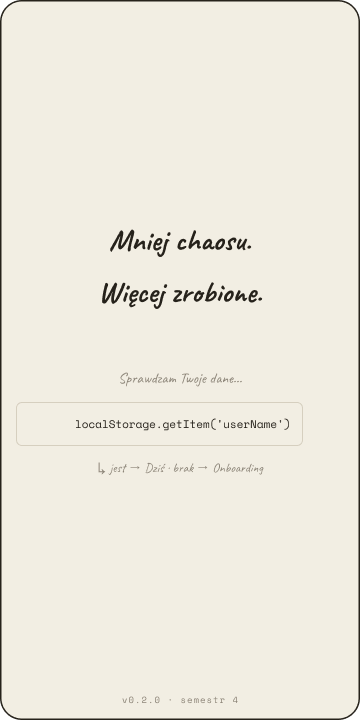 | 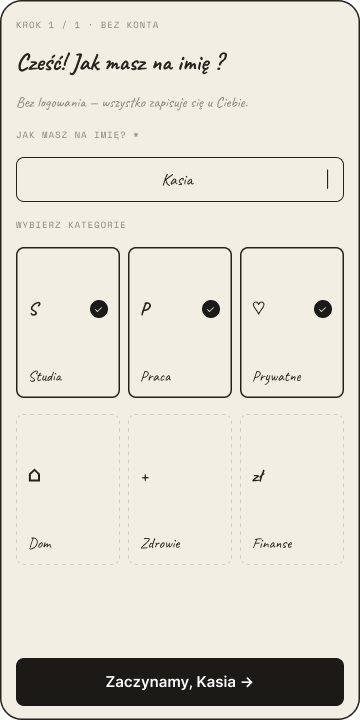 | 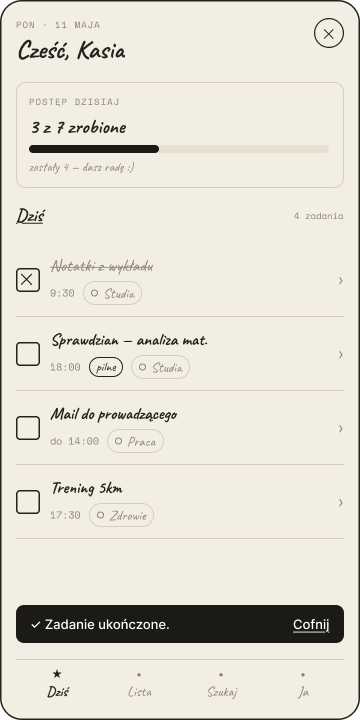 |
| **01 · Splash** — logika startu | **02 · Onboarding** — imię | **03 · Dziś** — kokpit |
| 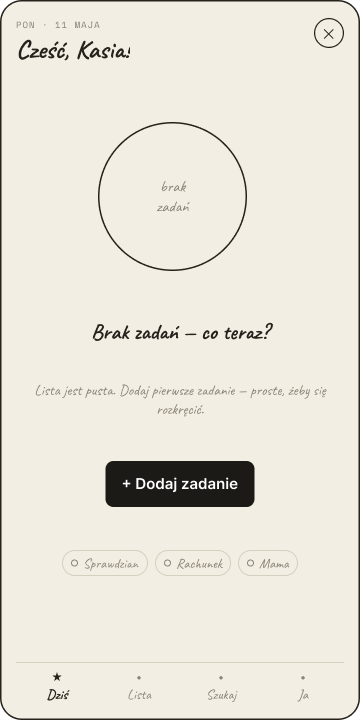 | 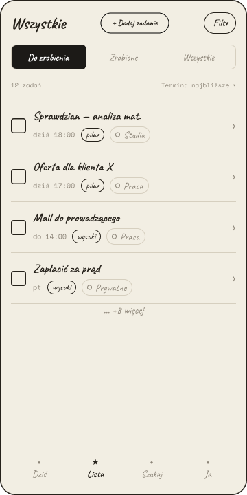 | 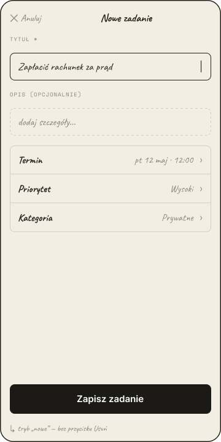 |
| **04 · Empty state** | **05 · Wszystkie zadania** | **06a · Nowe zadanie** |
| 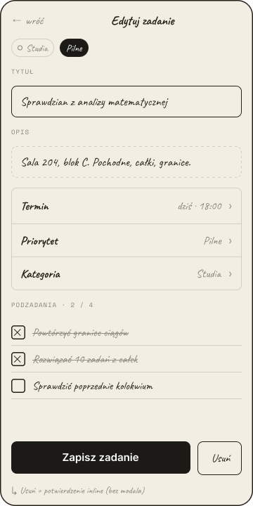 | 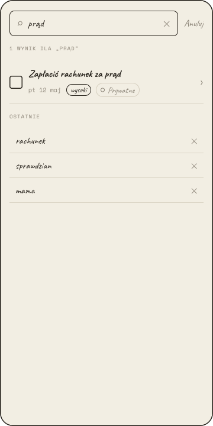 | 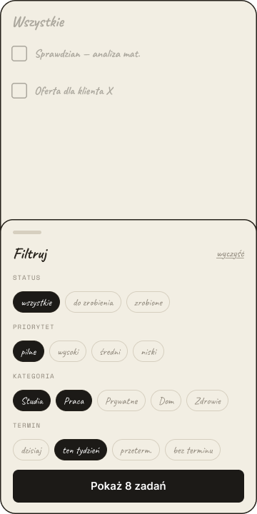 |
| **06b · Edycja zadania** | **07 · Szukaj** | **08 · Filtry** (bottom sheet) |
| 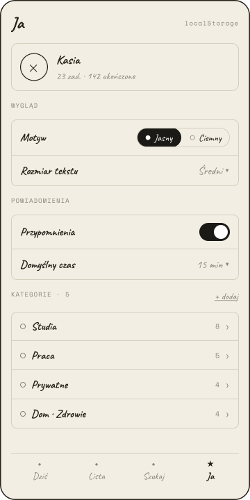 | | |
| **09 · Ja** (ustawienia, dark mode) | | |

---

## 3. Widoki desktop

Wzorzec: split-view (lista zawsze widoczna), stały sidebar, nowe/edycja w prawym panelu, filtry jako popover, usuwanie przez modal.

| | |
|---|---|
| 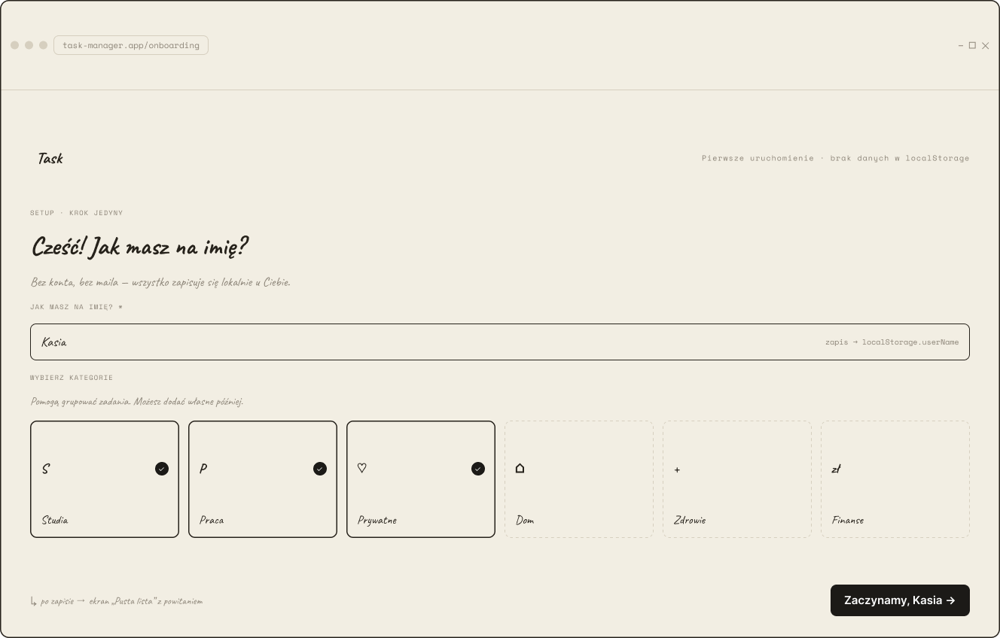 | 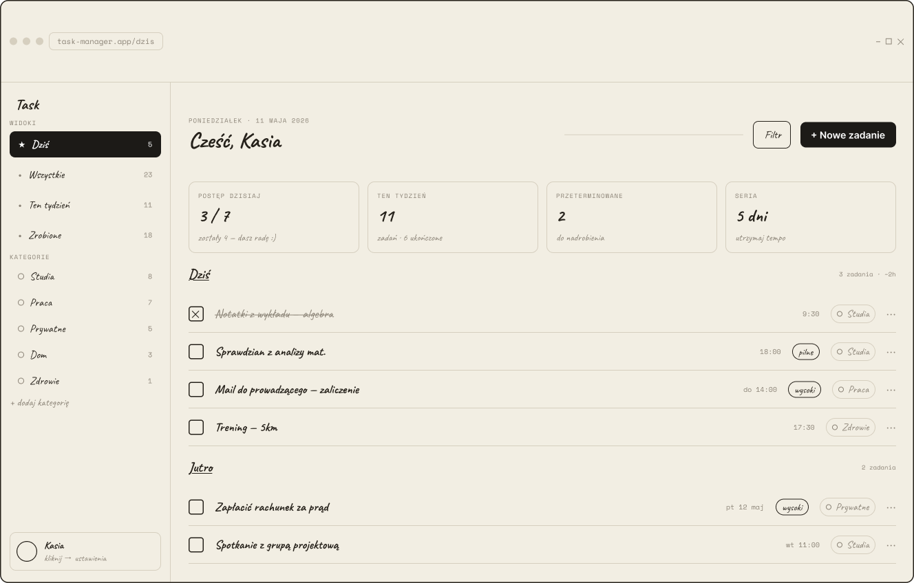 |
| **D·01 · Onboarding** | **D·02 · Dziś** (kokpit) |
| 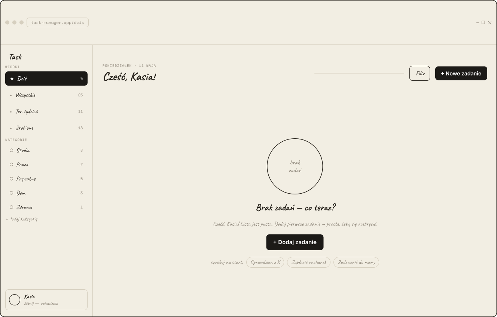 | 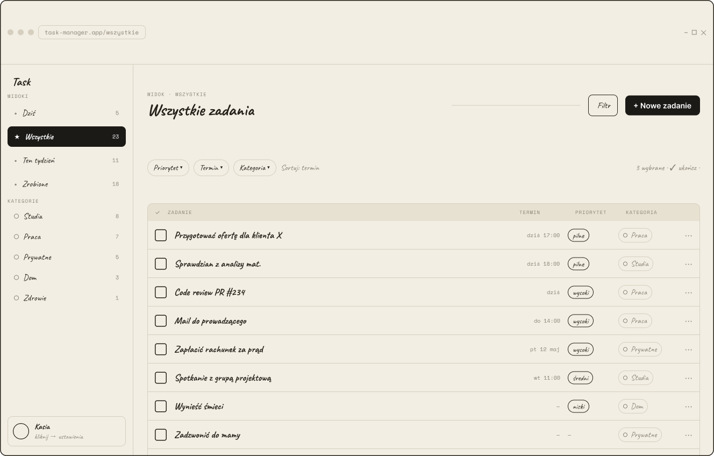 |
| **D·03 · Empty state** | **D·04 · Wszystkie** (tabela) |
| 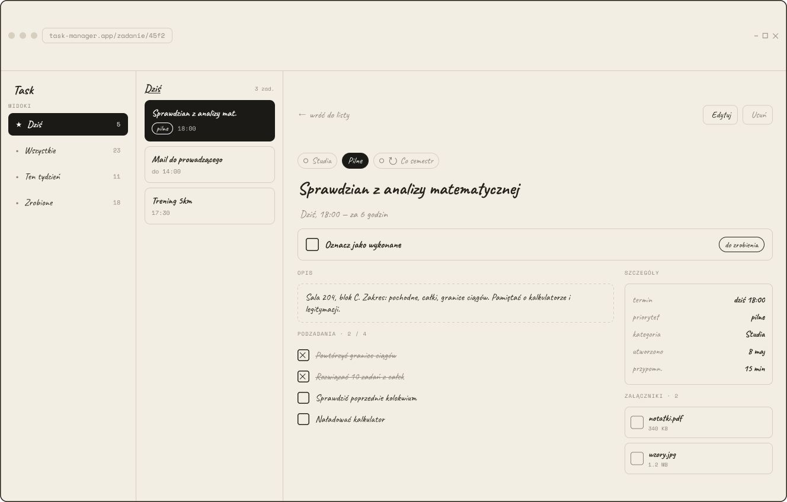 | 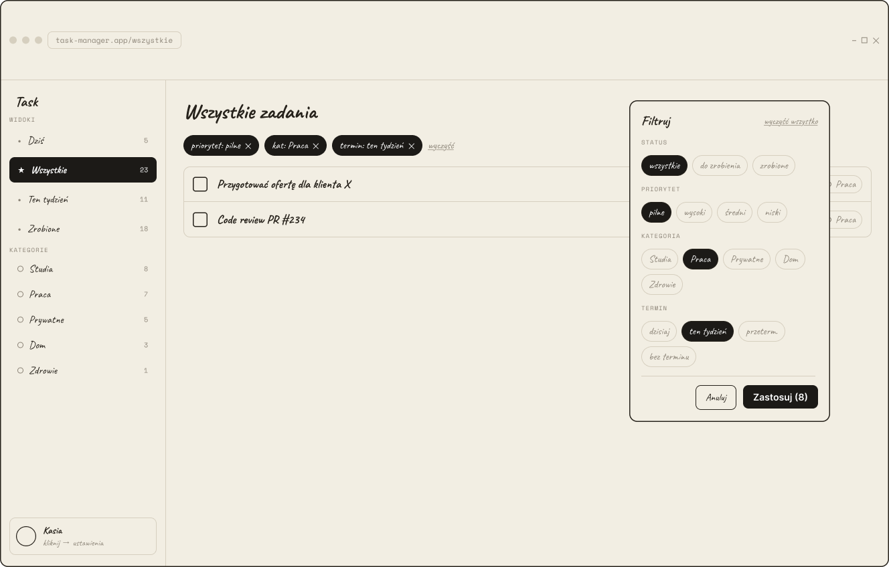 |
| **D·05 · Szczegóły / edycja** (panel) | **D·06 · Popover filtrów** |
| 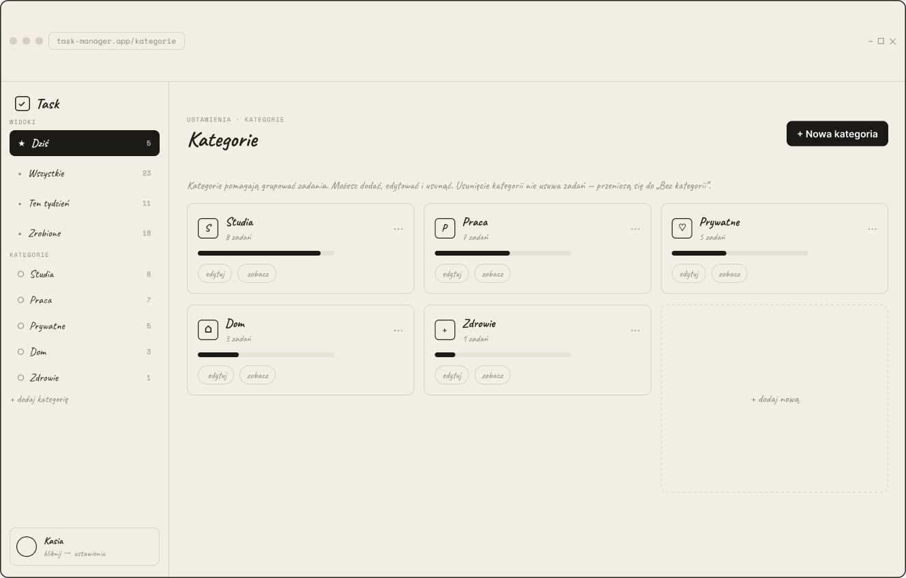 | 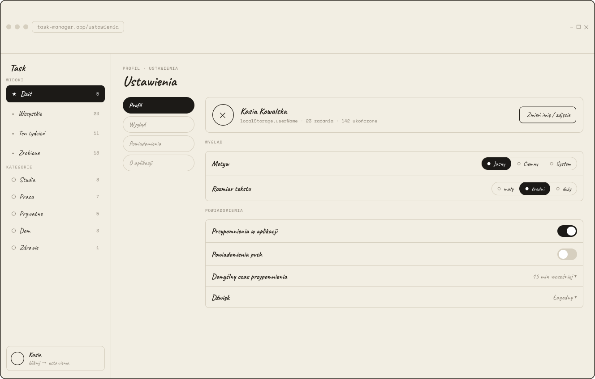 |
| **D·07 · Kategorie** | **D·08 · Ustawienia** |
| 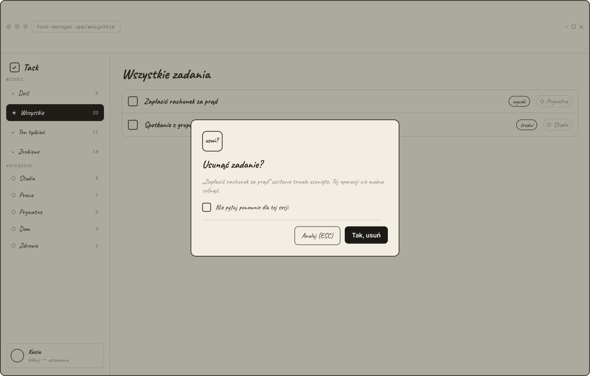 | |
| **D·09 · Modal usuwania** | |

---

## 4. User Flow

Dwa **osobne** diagramy — bo wzorce interakcji różnią się między platformami (push vs split-view). Wspólna jest tylko logika startu.

**Logika startu (wspólna):** Splash → sprawdzenie `userName` w localStorage → jeśli **jest** → główny widok (Dziś); jeśli **brak** → Onboarding → zapis imienia → Empty state.

### Flow · Mobile
Nawigacja push, pełne ekrany, dolny pasek, filtry = bottom sheet, usuwanie = inline z undo.

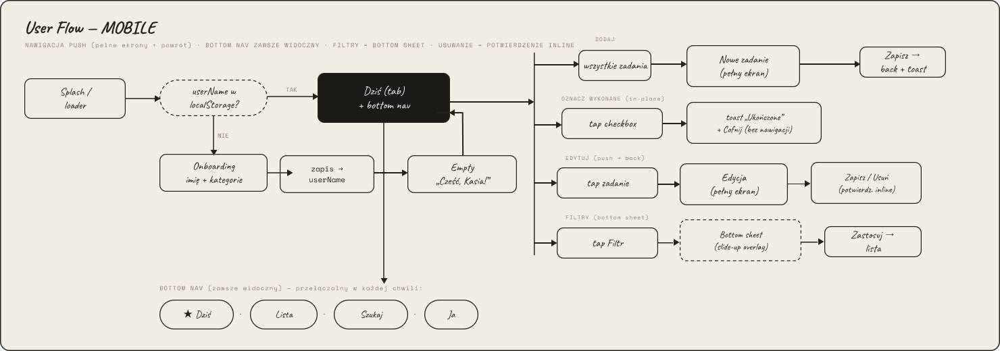

### Flow · Desktop
Split-view z listą zawsze widoczną, stały sidebar, nowe/edycja = prawy panel, filtry = popover, usuwanie = modal.

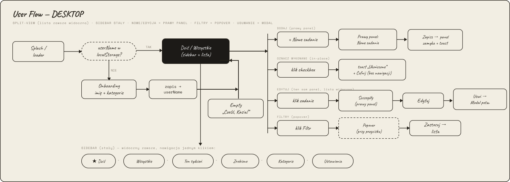

Trzy główne ścieżki pokryte w obu wariantach: **DODAJ zadanie**, **OZNACZ wykonane**, **EDYTUJ termin**.

---

## 5. Decyzje layoutowe (i dlaczego)

1. **Onboarding zamiast logowania.** Brief = localStorage, bez backendu. Imię to jedyny próg wejścia → zero tarcia dla Anny (osoba mniej techniczna), brak ekranu rejestracji.
2. **„Dziś" jako ekran startowy powracającego.** Anna chce widzieć „tylko dzisiejsze" — domyślny widok po starcie to kokpit dnia, nie pełna lista.
3. **Mobile: filtry w bottom sheet; desktop: popover.** Na wąskim ekranie modal od dołu jest naturalny kciukiem; na desktopie popover przy przycisku nie zasłania kontekstu listy (Marek pracuje z dużą liczbą zadań naraz).
4. **Usuwanie: mobile inline+undo, desktop modal.** Zapobieganie błędom (Anna). Na mobile undo jest mniej inwazyjne; na desktopie modal potwierdzający, bo kliknięcie myszą jest łatwiejsze do przypadkowego wywołania.
5. **Desktop „Wszystkie" jako tabela, mobile jako lista kart.** Marek na desktopie skanuje wiele kolumn (termin/priorytet/kategoria) naraz; na mobile karta z hierarchią pionową czyta się lepiej.
6. **Empty state jako osobny, zaprojektowany widok.** Pierwszy kontakt z pustą aplikacją prowadzi do pierwszego zadania zamiast pokazywać pustkę.

---

## 6. Następne kroki

- **ADR-0003 (routing):** widoki Dziś / Wszystkie / Szukaj / Ja → React Router v6 wynika wprost z tych wireframes. Do spisania przed implementacją.
- **Etap 3 (Hi-Fi, 20%):** design tokens (paleta light + dark na bazie krem/atrament — zachować distinctive charakter), komponenty z wariantami, prototyp klikalny 3 ścieżek. Eksporty Hi-Fi → [`docs/figma-exports/`](./docs/figma-exports/).
