# Etap 4 — Prototyp High-Fidelity (Hi-Fi) i Design System

> **Mapowanie do briefu:** To jest **Etap 3 wg briefu** („Projekt wizualny i prototyp Hi-Fidelity", 20% oceny). Numeracja plików w repozytorium jest przesunięta o jeden w stosunku do briefu.
> **Status:** Ukończony · **Źródło prawdy:** Figma — WSB PIU · Task Manager

Prototyp Hi-Fi stanowi wierne odzwierciedlenie struktury ustalonej w Etapie 3 (Low-Fi), wzbogacone o docelową warstwę wizualną: typografię, kolory, odstępy (spacing). 

Wszystkie widoki to natywne, edytowalne frame'y w Figmie. PNG-i w `docs/highfi/` to eksporty robocze do dokumentacji — przy każdej zmianie w Figmie re-eksportuj i nadpisz.

---

## 1. Inwentarz ekranów Hi-Fi

Zaprojektowano 12 widoków mobile + 12 widoków desktop. Ekrany mapują się na zaplanowane ścieżki (User Flow) z wireframe'ów, uwzględniając stany takie jak "pusta lista" (Empty) czy "ukończone zadanie" (done), oraz precyzyjne stany po filtracji (Prywatne).

| Widok / Funkcja | Mobile | Desktop | Opis |
|---|---|---|---|
| Splash | M · 01 | — | Ekran startowy z logotypem (tylko mobile). |
| Onboarding | M · 02 | D · 01 | Pytanie o imię; lekki próg wejścia. |
| Empty State | M · 03 | D · 02 | Pusty stan zachęcający do dodania pierwszego zadania. |
| Dziś (kokpit) | M · 04 | D · 03 | Główny widok powracającego użytkownika. |
| Dziś (done) | M · 05 | D · 04 | Sygnalizacja ukończenia (wyszarzenie + przekreślenie). |
| Wszystkie | M · 06 | D · 05 | Pełna lista (tabela na desktopie, karty na mobile). |
| Wszystkie (Prywatne)| M · 07 | D · 06 | Widok po zastosowaniu filtru aktywnej kategorii. |
| Filtry | M · 08 | D · 07 | Bottom sheet na mobile, Popover przycisku na desktopie. |
| Nowe zadanie | M · 09 | D · 08 | Formularz dodawania zadania (pełny ekran vs boczny panel). |
| Edycja / Szczegóły | M · 10 | D · 09 | Edycja z zachowaniem kontekstu (split-view na desktop). |
| Akcje specjalne | M · 11 (Szukaj) | D · 10 (Modal) | Wyszukiwarka mobile; Modal usuwania dla zapobiegania błędom. |
| Ustawienia / Inne | M · 12 (Ust.) | D · 11, D · 12 | Zarządzanie kategoriami i opcjami aplikacji. |

---

## 2. Widoki mobile

Wzorzec: nawigacja push (pełne ekrany), dolny pasek nawigacji, filtry jako bottom sheet.

| | | |
|---|---|---|
| 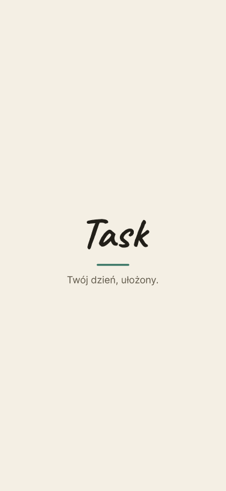 | 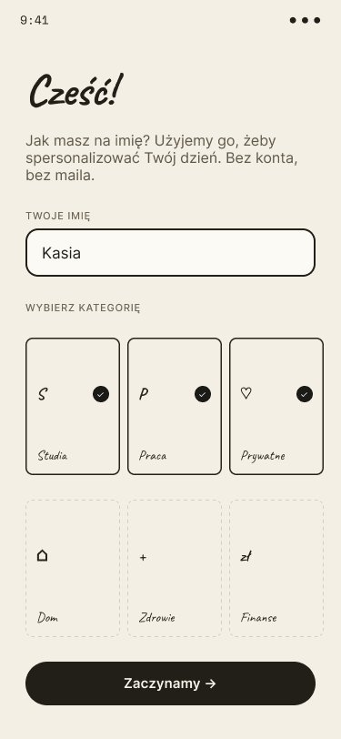 | 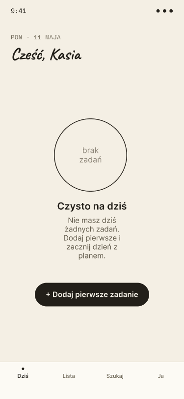 |
| **M · 01 Splash** | **M · 02 Onboarding** | **M · 03 Empty** |
| 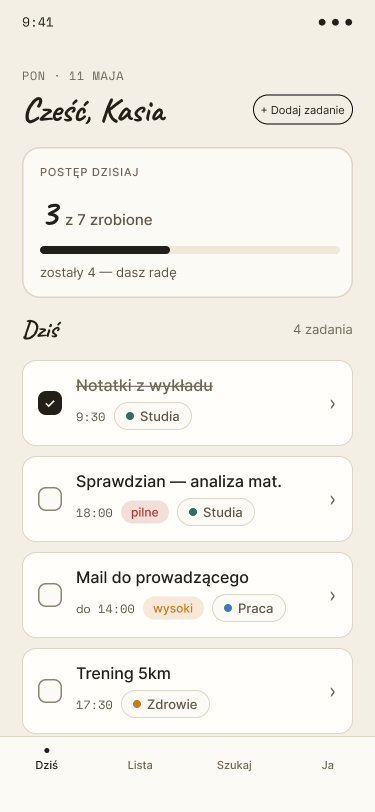 | 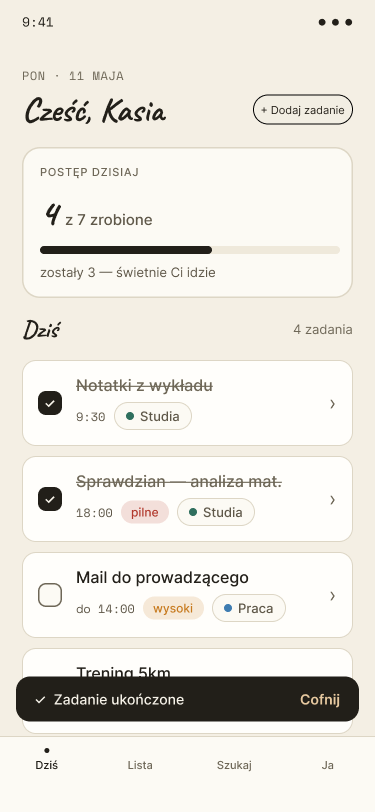 | 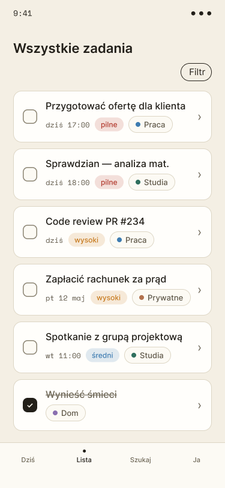 |
| **M · 04 Dziś** | **M · 05 Dziś · done** | **M · 06 Wszystkie** |
| 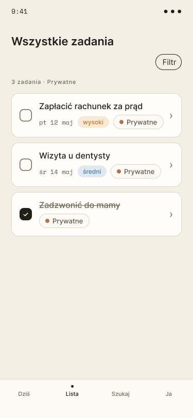 | 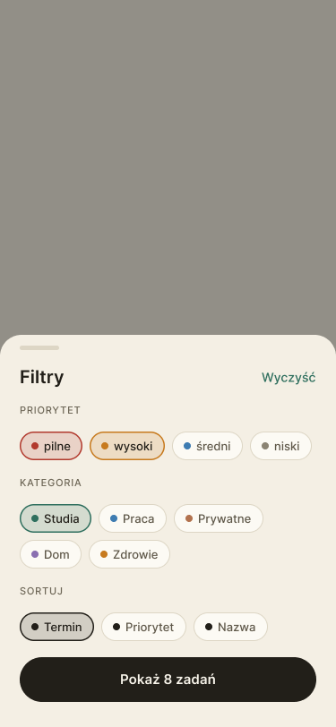 | 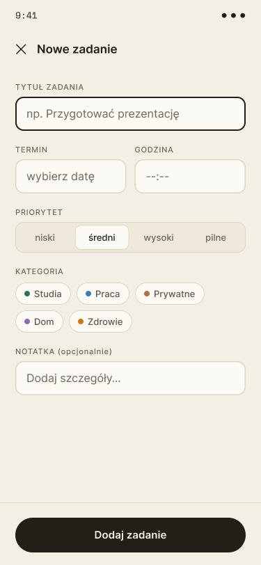 |
| **M · 07 Wszystkie · Prywatne** | **M · 08 Filtry** | **M · 09 Nowe zadanie** |
| 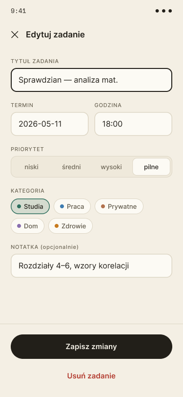 | 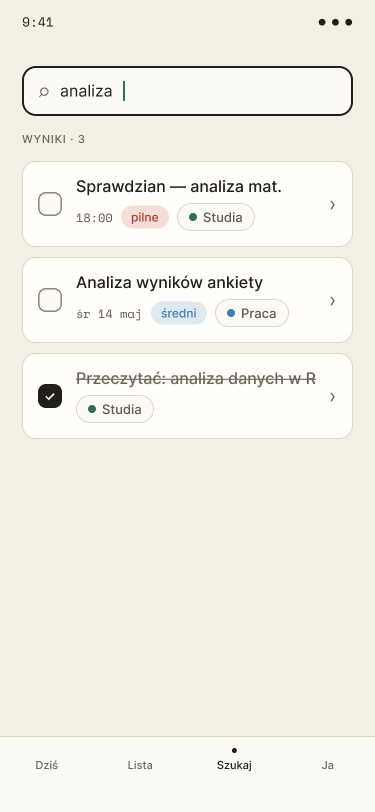 | 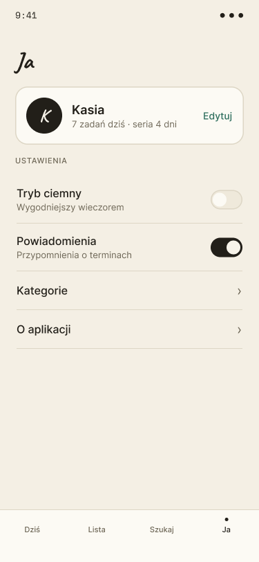 |
| **M · 10 Edycja** | **M · 11 Szukaj** | **M · 12 Ustawienia** |

---

## 3. Widoki desktop

Wzorzec: split-view (lista zawsze widoczna), stały sidebar, nowe/edycja w prawym panelu.

| | |
|---|---|
| 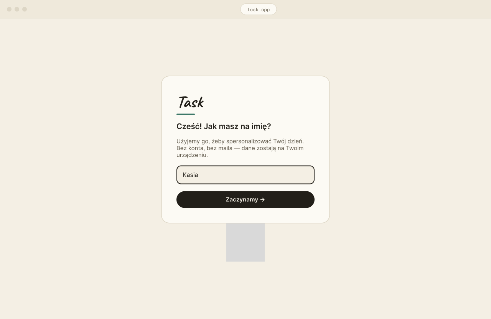 | 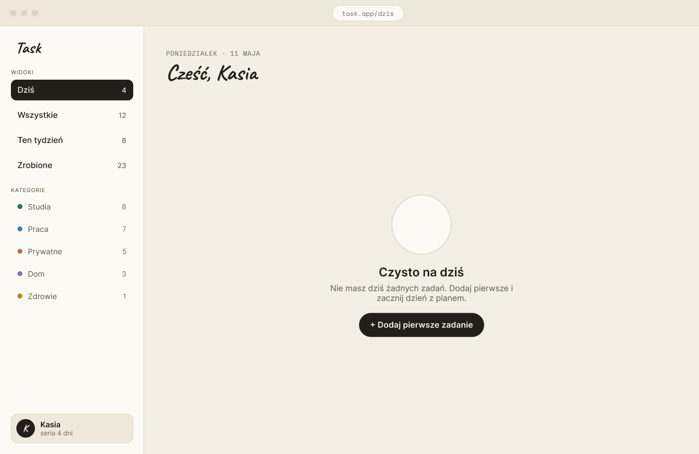 |
| **D · 01 Onboarding** | **D · 02 Empty** |
| .png) | 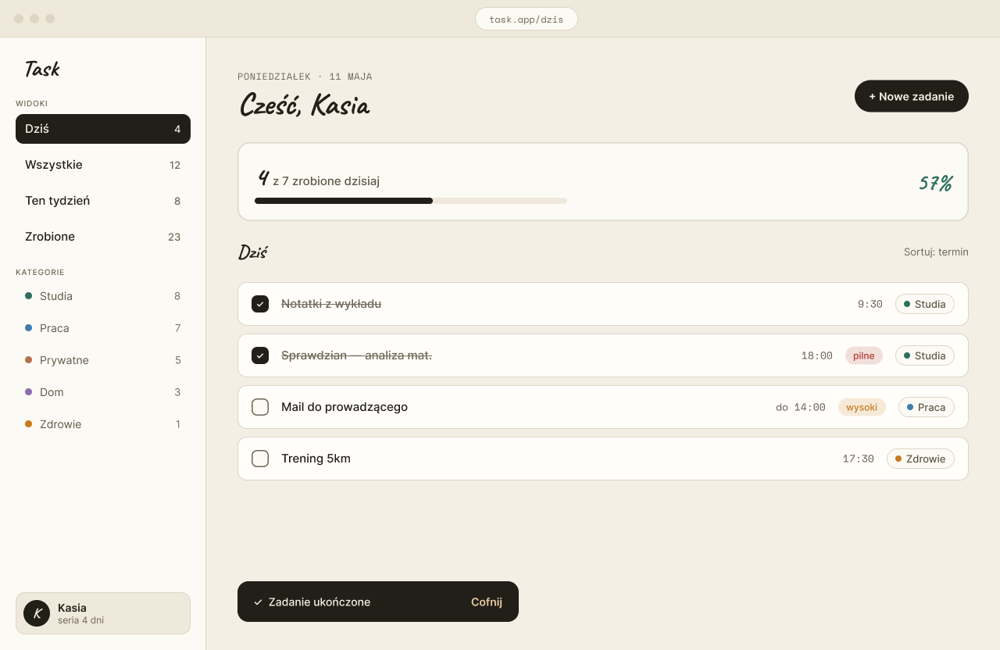 |
| **D · 03 Dziś (kokpit)** | **D · 04 Dziś · done** |
| .png) | 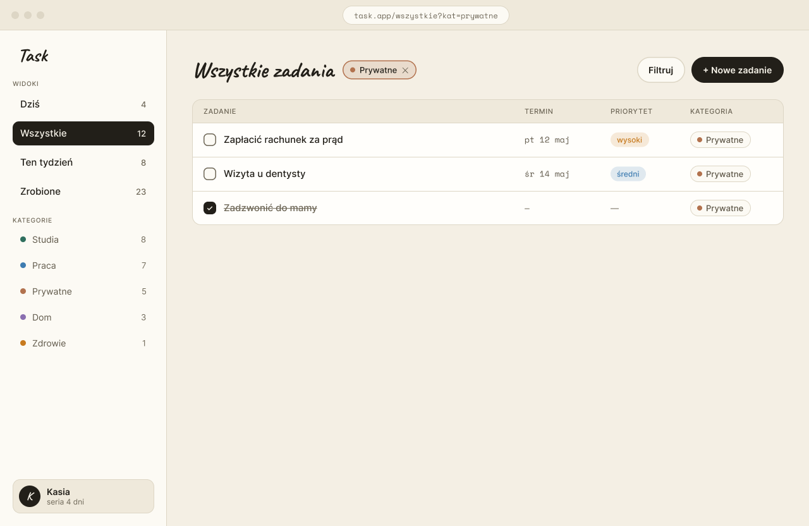 |
| **D · 05 Wszystkie (tabela)** | **D · 06 Wszystkie · Prywatne** |
| 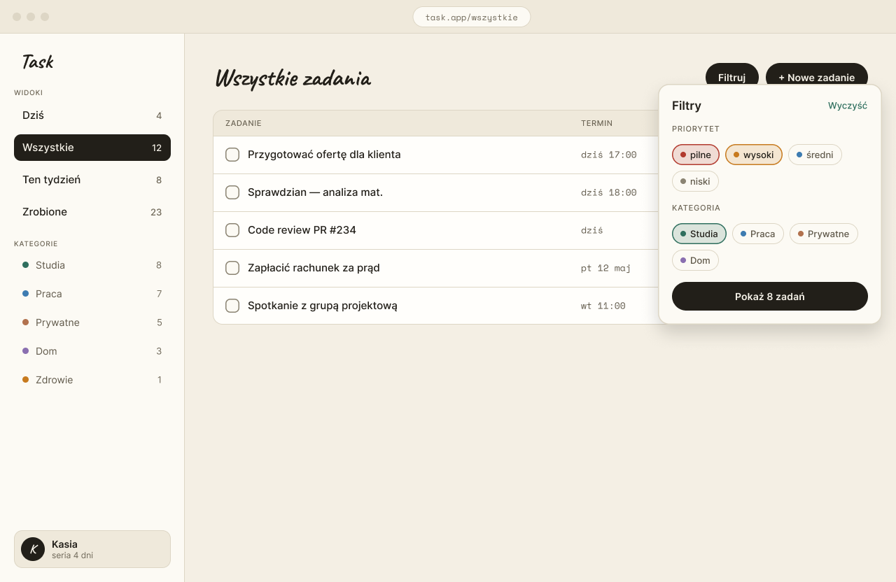 | 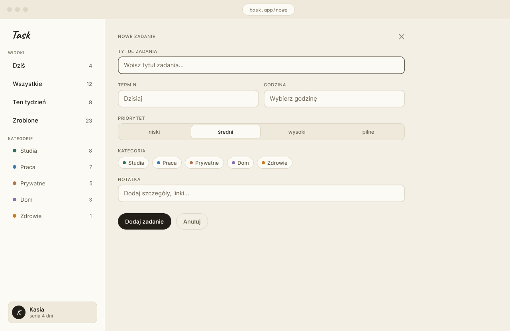 |
| **D · 07 Popover filtrów** | **D · 08 Nowe zadanie** |
| 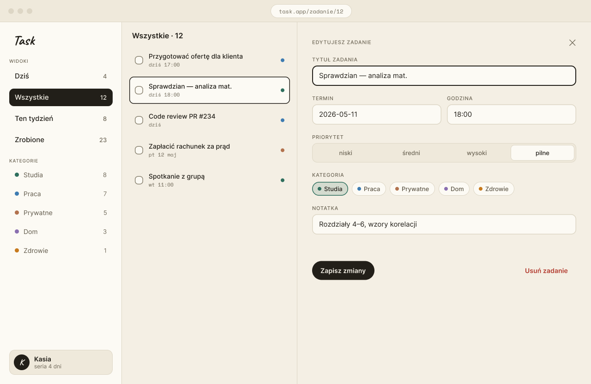 | 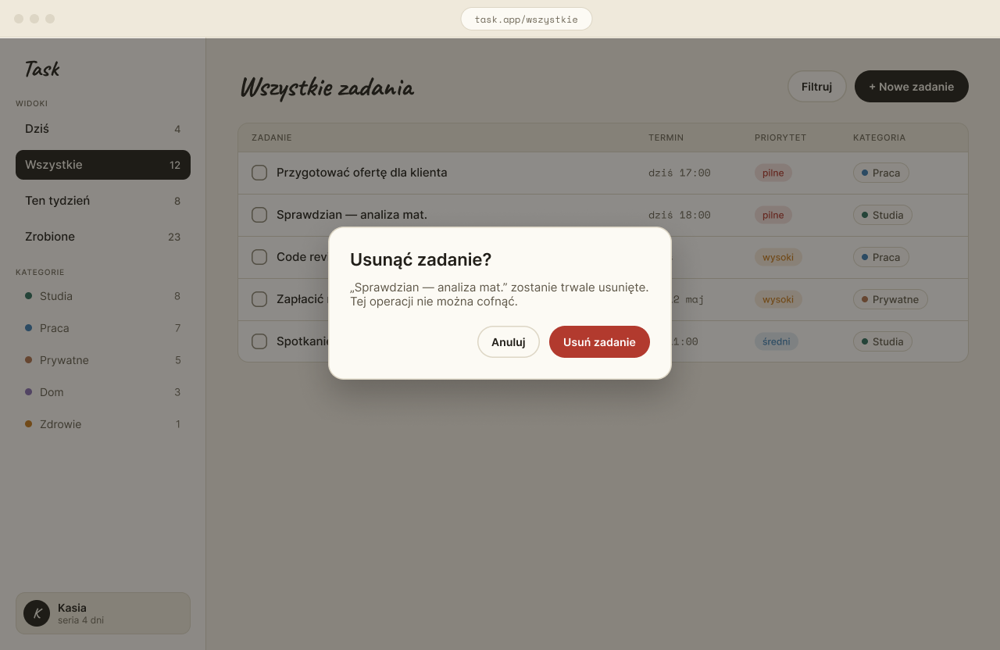 |
| **D · 09 Szczegóły** | **D · 10 Modal usuwania** |
| 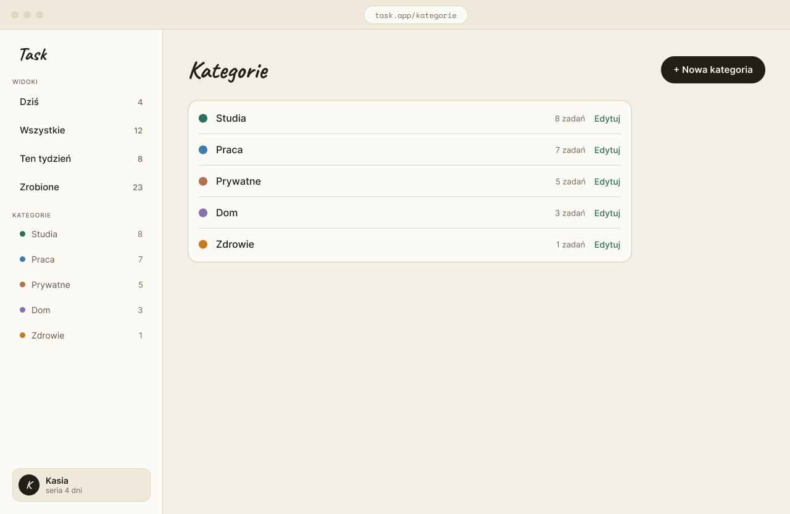 | 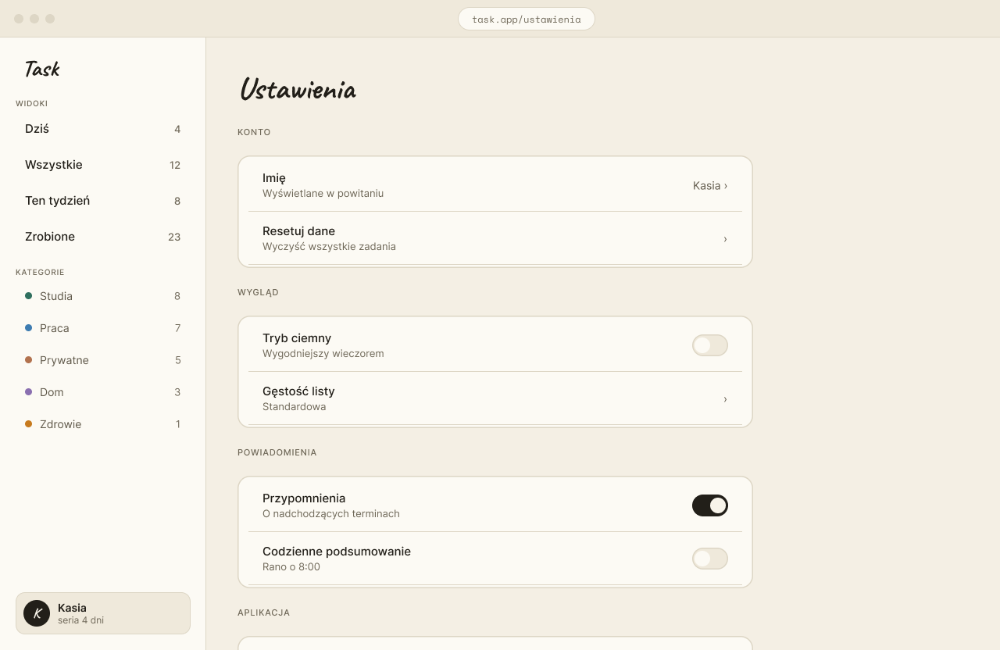 |
| **D · 11 Kategorie** | **D · 12 Ustawienia** |

---

## 4. Decyzje wizualne (i dlaczego)

1. **Dwa fonty:** W nagłówkach użyliśmy czcionki odręcznej, żeby apka była bardziej "ludzka" i osobista. Na listach zadań użyliśmy prostego fontu, żeby wszystko było czytelne i nie męczyło wzroku, nawet jak masz dużo rzeczy do zrobienia.
2. **Łatwe klikanie:** Filtry i kategorie mają kształt zaokrąglonych pigułek. Na telefonie to ważne – w taki kształt dużo łatwiej trafić kciukiem niż w mały, kanciasty przycisk.
3. **Nawigacja bez przeładowywania:** Na komputerze zrobiliśmy wysuwany panel boczny. Dzięki temu użytkownik edytuje zadanie, a w tle cały czas widzi swoją główną listę. Nie musi ciągle skakać między stronami, co oszczędza czas.
4. **Myślenie o "pustych" ekranach:** Nie projektowaliśmy tylko idealnej wersji z listą zadań. Zrobiliśmy też ekrany dla kogoś, kto dopiero zaczyna i jeszcze nic nie dodał. Dzięki temu pierwszy użytkownik nie poczuje się zagubiony, bo aplikacja od razu podpowie mu, co ma zrobić.

---

## 5. Następne kroki

- **Etap 5 wg briefu:** Testy użyteczności (Think-Aloud) z użytkownikami, uwzględniające przetestowanie ścieżki dodania i usunięcia zadania.
- **Etap 6:** Implementacja. Odwzorowanie struktury 1:1 za pomocą CSS Tailwind / React, na bazie Design Tokenów wynikających wprost z wyeksportowanych makiet Hi-Fi.